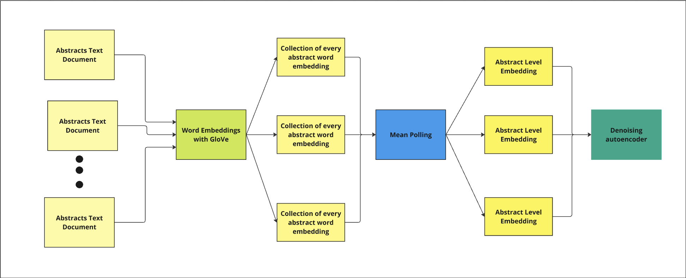

## Dataset Description

This dataset available for search is a combination of the following data:

8398 publications extracted from [Springer](https://link.springer.com) that could be Research Articles or conference papers from 2025-2015

67,601 publications selected from the [arXiv Dataset](https://www.kaggle.com/datasets/Cornell-University/arxiv) from 2024-2015


[ArXiv](https://arxiv.org/) is a free distribution service, and an open-access archive for scholarly articles in the fields of physics, mathematics, computer science, quantitative finance, economics, etc. The articles from this archive are from a [Kaggle dataset](https://www.kaggle.com/datasets/Cornell-University/arxiv).


## Embedding Generation Process

500 Publications are represented as a dense vector embedding. The process begins by converting each word in the publication's abstract to a 50-dimensional GloVe vector. Then, a mean-pooling step transforms these word-level embeddings into a single 50-dimensional vector for each abstract. To tailor these embeddings to our dataset, we use a denoising autoencoder with a linear encoder-decoder structure, which reduces the dimensionality to 32. This model is trained to focus on features relevant to the document collection, enhancing its ability to capture essential semantic relationships.




1. Word embeddings via GloVe.
2. Mean-pooling to obtain abstract-level embeddings.
3. Denoising autoencoder with encoder-decoder layers and ReLU activation.

## Training Process and Loss Function

The training process uses a denoising autoencoder to create embeddings that capture the core semantics of each abstract. Gaussian noise is added to the input embeddings, training the model to generate robust features by reconstructing the original embeddings. The loss function is Mean Squared Error (MSE), which measures the average squared difference between the original and reconstructed embeddings. Minimizing MSE ensures that the model learns to denoise embeddings while preserving important semantic features.

Mean Squared Error (MSE) loss function:

$$
MSE = \frac{1}{N} \sum_{i=1}^{N} (x_i - \hat{x}_i)^2
$$

where \( x_i \) represents the original embedding, \( \hat{x}_i \) represents the reconstructed embedding, and \( N \) is the number of features in each embedding. This objective helps the model create embeddings that retain semantic similarity while reducing noise.


### Test Cases

In this section, we provide examples of different types of search queries and their results. These examples demonstrate the functionality and behavior of the search engine under various conditions.

#### 1. Test that yields 10 results
**Query:** `Dance samba music`   
**Comment:** Searching for "music dance samba" yields exactly 10 results.

#### 2. Test that yields less than 10 results
**Query:** `Brazilian History`  
 
**Comment:** Searching for "Brazilian History" returns fewer than 10 results, because there aren't enough relevant documents in the database (we are applying a minimum relevance filter).

#### 3. Test that yields something non-obvious
**Query:** `Love`  

**Comment:** The search for "Love" suggest somethig related to sentiment, but it yields articles on unexpected topics, such as `Vortices in Bose-Einstein Condensates: Theory` with a similarity of 0.9586576223373413 This non-obvious result could potentially be caused by using a small query input.
## Running the Project with Docker

```bash
docker build -t home .
docker run -d -p 1413:8888 home
```


## Authors
[Tomás Alessi](https://github.com/alessitomas)
